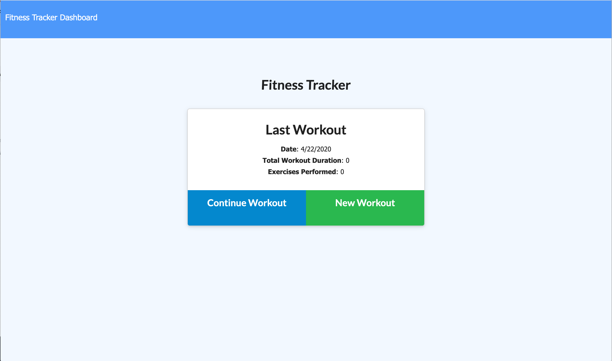
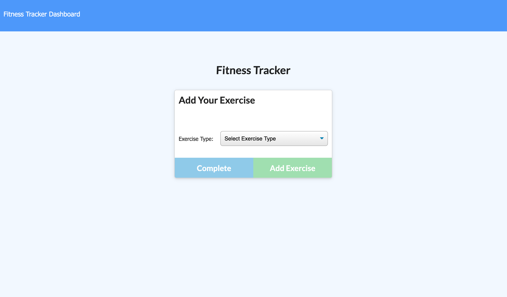
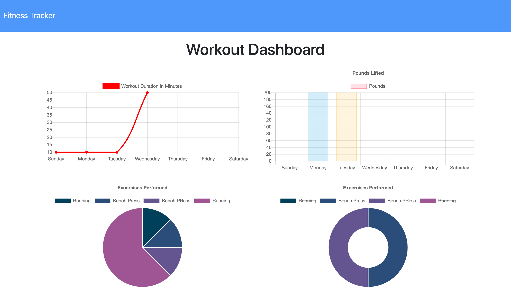

# NoSQL Workout Tracker

This application is a workout tracker. I was provided with the front end code. I created a Mongo database with a Mongoose schema and handled routes with Express.

## Links

* [Deployed Application](https://stephtracker.herokuapp.com/)

* [Github Repository](https://github.com/smithse4/17-fitness-tracker)

## User Story

* As a user, I want to be able to view, create, and track daily workouts. I want to be able to log multiple exercises in a workout on a given day. I should also be able to track the name, type, weight, sets, reps, and duration of exercise. If the exercise is a cardio exercise, I should be able to track my distance traveled.

## Business Context

A consumer will reach their fitness goals quicker when they track their workout progress.

## Utility

When the user loads the page, they are given the option to create a new workout, or continue with their last workout.

The user is able to:

  * Add exercises to a previous workout plan.

  * Add new exercises to a new workout plan.

  * View the combined weight of multiple exercises on the `stats` page.

Screenshots of application:

